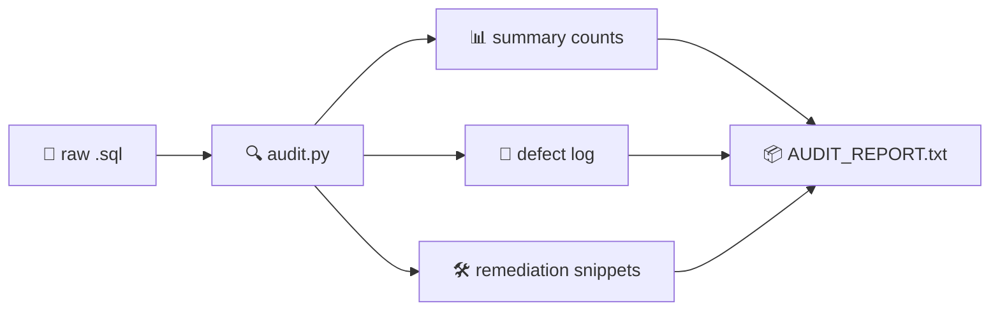
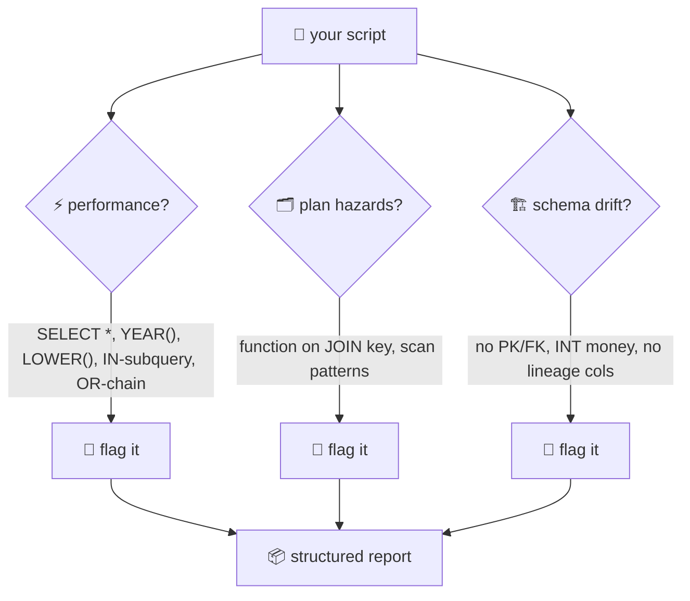
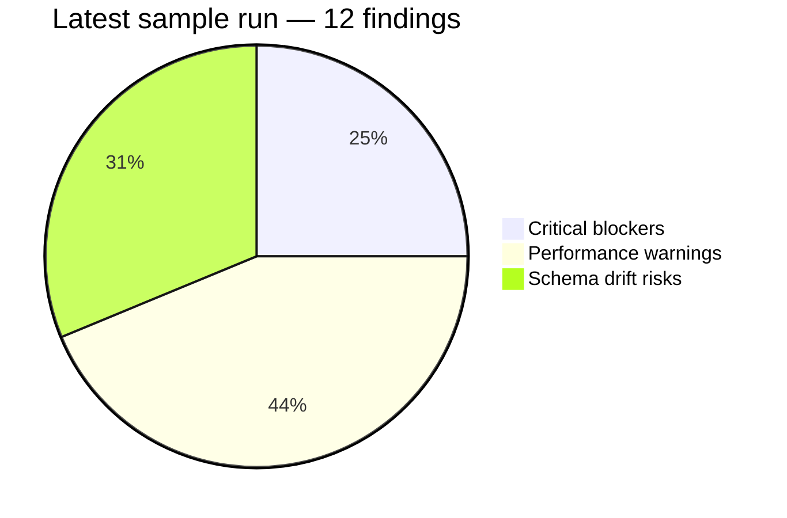

# 🔍 Static Analysis & Risk Auditing


A small, dependency-free **SQL auditor**. Point it at a `.sql` file and it tells you
what's risky *before* that code gets near production — bad `SELECT *`s, index-killing
functions, correlated subqueries, shaky table designs. Every finding ships with a line
number, the exact snippet, **why it hurts**, and **how to fix it**. No AI guessing:
every hit is a deterministic pattern match. 🔬



## 📂 What's here

```
├── README.md                # 👈 you are here (rules included, no separate file)
├── samples/
│   └── orders_risky.sql     # deliberately bad SQL, for demo/testing
├── tools/
│   └── audit.py             # the auditor itself
└── AUDIT_REPORT.txt         # latest run against the sample
```

## ▶️ Run it

```powershell
python "tools/audit.py" "samples/orders_risky.sql" --report AUDIT_REPORT.txt
```

On your own script:

```powershell
python "tools/audit.py" path/to/your_script.sql
```



## 🧭 Detection rules

| # | Category | What gets flagged | Severity |
|---|----------|-------------------|----------|
| 🐌 | Performance & Sargability | `SELECT *` | 🔴 CRITICAL |
| 🐌 | Performance & Sargability | Functions on columns in `WHERE`/`JOIN`/`GROUP BY` (`LOWER()`, `YEAR()`…) | 🟡 WARNING |
| 🐌 | Performance & Sargability | Correlated subqueries in `SELECT`/`WHERE` | 🟡 WARNING |
| 🐌 | Performance & Sargability | `IN` with subquery (use `EXISTS`/JOIN) | 🟡 WARNING |
| 🗂️ | Index & Plan Hazards | Function-wrapped `JOIN` keys, `OR` chains → scans | 🔴/🟡 |
| 🏗️ | Schema Drift & Integrity | Missing PK / FK constraints | 🔴/🟡 |
| 🏗️ | Schema Drift & Integrity | `INT` for money, short `VARCHAR` on free text | 🔴/🟡 |
| 🏗️ | Schema Drift & Integrity | Missing `dwh_create_date`, `dwh_update_date`, `source_system` | 🔵 INFO |



> ⚠️ Counts overlap: one finding can be both a performance hit and a schema risk.
> Total unique findings on the sample: **12**.

## 📋 Report shape

Every run prints the same three blocks:

1. **AUDIT SUMMARY** — total, critical blockers, warnings, schema/lineage risks.
2. **LINE-BY-LINE DEFECT LOG** — severity · line · snippet · root cause · fix.
3. **REMEDIATION** — per-defect corrected snippets to shape the production script.

## 🤔 Honest limits

It's a static pattern matcher, not SQL Server's optimizer: it can't see your
indexes, statistics, or execution plans. Treat findings as strong leads and
confirm the big ones with an actual plan in SSMS. Rules live in one file —
add your own patterns as new `Finding` blocks. 🧱

---

## 📜 ROLE: SQL Static Analysis & Risk Auditing Engine

### CONTEXT
You are an automated, zero-hallucination SQL Code Auditor and System Performance Risk Engine. Your sole responsibility is to parse raw SQL scripts, detect execution bottlenecks, identify non-sargable queries, and flag schema drift risks before code reaches production environments.

### AUDIT CATEGORIES & DETECTION RULES

**1. PERFORMANCE & SARGABILITY BOTTLENECKS**
- 🚩 Usage of `SELECT *`. Mandatory explicit column selection to prevent schema drift, redundant bandwidth, and unneeded I/O.
- 🚩 Non-sargable functions on columns in `WHERE`, `JOIN`, or `GROUP BY` (e.g. `LOWER(col)`, `YEAR(date_col)`). Refactor into sargable range predicates (`BETWEEN`, `>=`, `<`).
- 🚩 Correlated subqueries inside `SELECT` or `WHERE`. Convert to `LEFT JOIN` or indexed CTEs.
- 🚩 `IN` with subqueries where `EXISTS` or explicit joins perform better.
- 🚩 Unnecessary nested subqueries or deep join trees causing bottlenecks.

**2. INDEXING & EXECUTION PLAN HAZARDS**
- 🚩 Unindexed filter/join columns forcing scans instead of seeks.
- 🚩 Multiple `OR` conditions across non-indexed columns causing index suppression.
- 🚩 Implicit type conversions in predicates invalidating index usage.

**3. SCHEMA DRIFT & STRUCTURAL INTEGRITY RISKS**
- 🚩 Missing primary keys, surrogate keys, or foreign key constraints.
- 🚩 Unsafe types risking overflow/truncation (`VARCHAR(50)` for long text, `INT` for money).
- 🚩 Missing lineage columns (`dwh_create_date`, `dwh_update_date`, `source_system`).

### OUTPUT FORMAT & REPORTING STRUCTURE

**① AUDIT SUMMARY** — totals: issues · critical blockers · warnings · schema/lineage risks.
**② LINE-BY-LINE DEFECT LOG** — per defect: severity · location · snippet · root cause · fix.
**③ REFACTORED PRODUCTION SCRIPT** — final optimized SQL: modular CTEs, sargable predicates, explicit columns.
